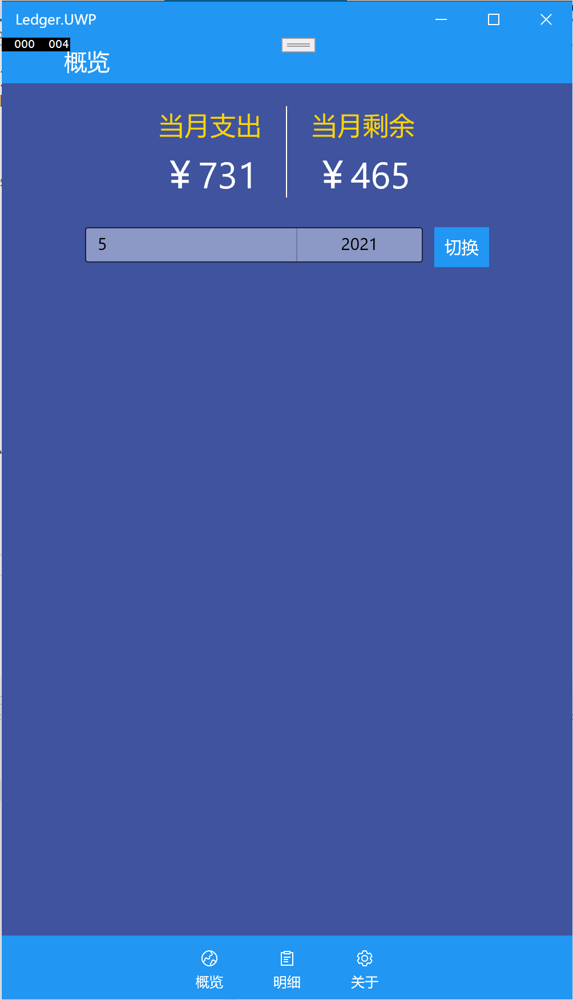
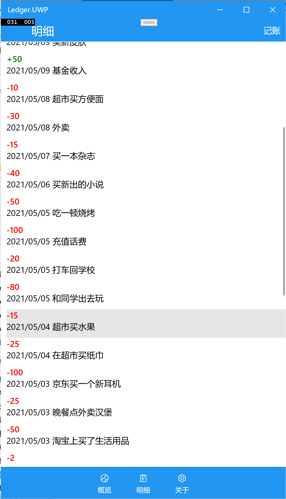
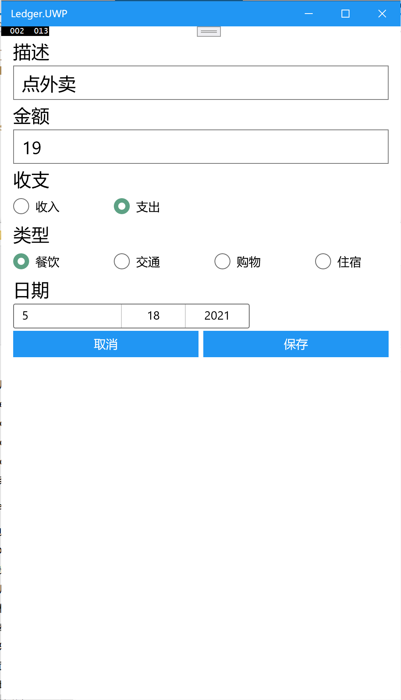
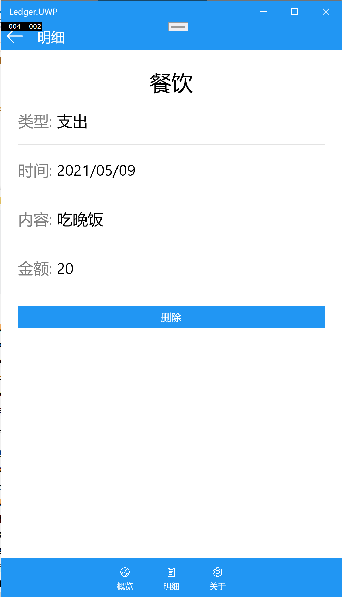

<h1 align="center">Ledger</h1>

    a minimalist Ledger app.

## 介绍

Ledger是使用[Xamarin.Forms](https://dotnet.microsoft.com/apps/xamarin/xamarin-forms)开发的跨平台记账本。

作为可视化程序设计技术及应用的结课团队作业。

成员：[Reilkay](https://github.com/Reilkay)、[ShinyAkko](https://github.com/ShinyAkko).

项目GitHub地址：https://github.com/Reilkay/Ledger-cs

项目Gitee地址：https://gitee.com/reilkay-shinyakko/ledger

## 软件架构

MVVM + IServices

## 截图

概览

明细

记账

明细详情

